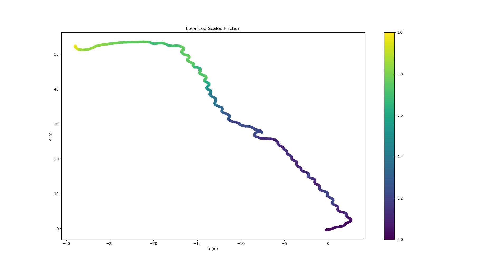
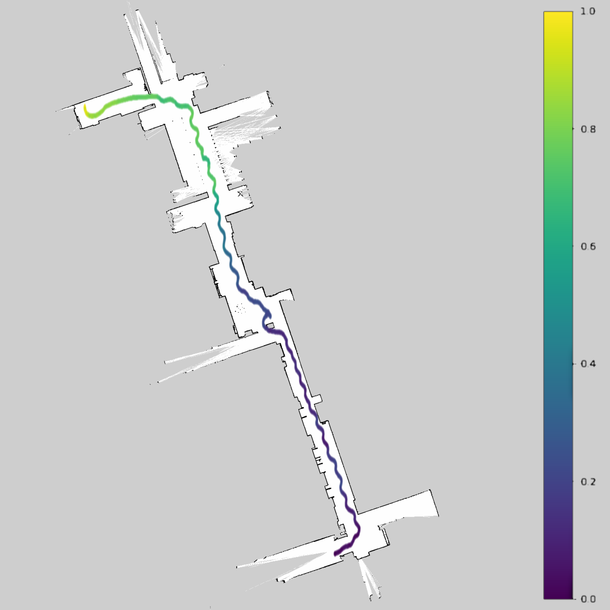

# FrictionMaps
#### Tire-Road Friction Estimation for the [F1/10 platform](https://f1tenth.org/).
In this repository, we implement a three-stage kalman filter for state estimation and tire-road friction coefficient estimation. For more details on the theoretical implementation of this filtering hierarchy, please consult the [report](./Report).

# Running the Code
This repository implements two main pieces of code. The first script you can run is the `stateLogger.py` ROS node. This ROS node runs in realtime on the F1/10th race car and logs all relevant states (and more) to corresponding timestamped folders and accordingly named csv files. To add this as a node to your workspace, simply clone this repository and copy the stateEstimation folder to your ROS workspace. To learn more about the output of the stateLogger, consult the [datasets](./DataSets) section of this repository.

The second script you can run is `stateEstimation.py`. This script runs the three kalman filter estimation hierarchy and produces estimation plots for the dataset of your chosing. To select which dataset to run, simply change the variable `dataSetNumber` variable in main to your desired dataset. 

### Using a Custom Dataset
If you have recorded your own custom dataset using the F1/10th platform, please ensure that you have the done the following:
- **Dataset Folder Renaming:** Dataset folder must be renamed from the timestamp to _"DS"_ + ***{your_dataset_number}***, where ***{your_dataset_number}*** is a vacant number of your chosing. If adding to our already collected datasets, you would need to use a number greater than 5.
- **Dataset Folder Location:** The dataset folder you just renamed must be located in the _"DataSets"_ folder in this repository. Otherwise, our code will fail to find this dataset. If you wish to change the "DataSets" directory, please change `dataSetPath` in line 53 in `stateEstimation.py`.
- **Re-parametrize StateEstimator Class:** The default class intiialization of the ``StateEstimator`` class uses the parameters of our F1/10 car. Your car's measurements may vary and you should update these paramters to match your vehicle. To do this, pass in your parameters to ``StateEstimator`` in line 60 in ``stateEstimation.py``

### Expected Output
The expected output form running this code on dataset 3 is the following friction localization map:

Note that the visualized map does not show the actual values of the estimated friction since the values of friction vary too little for the visualization to be observable (all features are the same otherwise). This is a result of modelling the friction as a constant value in the second unscented kalman filter of our estimation hierarchy. Instead, our visualization selects a slice of timestamps and this slice is then centered to be between 0 and 1. We then visualize the values of the rear-wheel friction localized at the positions estimated from the particle filter. 

Fusing this map with the original occupancy grid, we get the following friction grid:

